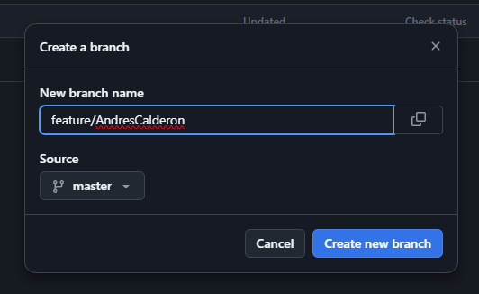

# CVDS-introGIT
Introducción a GIT de la materia CVDS

PARTE I (Trabajo Individual).

Crea un repositorio localmente.

Agrega un archivo de ejemplo al repositorio, el README.md puede ser una gran opción.

 Averigua para qué sirve y como se usan estos comandos git add y git commit -m “mensaje”

#### _Git add manda los cambios al área de preparación, son los cambios que se subirán con un commit_

#### _Git commit – m guarda los archivos que están en el área de preparación, además añade un comentario._

Abre una cuenta de github, si ya la tienes, enlazala con el correo institucional.

Crea un repositorio en blanco (vacío) e GitHub.

Configura el repositorio local con el repositorio remoto.

Sube los cambios, teniendo en cuenta lo que averiguaste en el punto 3 Utiliza los siguientes comando en el directorio donde tienes tu proyecto, en este orden:

Configura el correo en git local de manera correcta

### Parte 2 en parejas

El owner agrega al colaborador con permisos de escritura en el repositorio que creó en la parte 1
#### _Se mandó la solicitud al colaborador por correo_

Owner y Colaborador editan el archivo README.md al mismo tiempo e intentan subir los cambios al mismo tiempo.
¿Que sucedió?
#### _Salió el siguiente error:_

Volver a repetir un cambio sobre el README.md ambas personas al tiempo para volver a tener conflictos.

La persona que perdió la competencia de subir los cambios, tiene que resolver los conflictos, cúando haces pull de los cambios, los archivos tienen los símbolos <<< === y >>> (son normales en la resolución de conflictos), estos conflictos debes resolverlos manualmente. 

Cambios en la rama:

PARTE III (Trabajo de a parejas)
¿Hay una mejor forma de trabajar con git para no tener conflictos?

#### _Si, se puede trabajar en ramas y evitar tocar la rama main/master, ya que son más faciles de manejar y fusionar._

¿Qué es y como funciona el Pull Request?

#### _Es una solicitud que se hace para que los cambios de una rama se revisen y fusionados._

Creen una rama cada uno y suban sus cambios

Nueva rama Andres Calderon

Tanto owner como colaborador hacen un cambio en el README.md y hacen un Pull Request (PR) a la rama main/master

